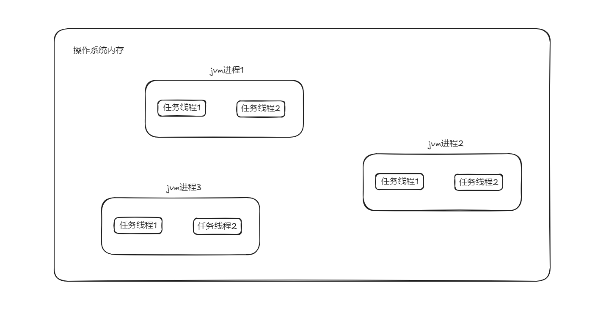

# java个人学习心得笔记.

## java线程.

### 什么是线程？ 

> java编写的程序都是在jvm中运行，当使用java命令启动一个java应用程序后就会启动一个jvm进程。
> 在同一个jvm进程中，有且只有一个进程，就是它自己。在这个jvm环境中，所有程序代码的运行都是以线程来运行。
> 多线程可以理解为***多任务***，一个进程中的多个线程是共享内存块的，当有新的线程产生的时候，
> 操作系统不分配新的内存，而是让新线程共享原有的进程块的内存。因此，***线程间的通信很容易，速度也很快***。
> 不同的进程因为处于不同的内存块，因此进程之间的通信相对困难。进程是指一个内存中运行的应用程序，
> 每个进程都有自己独立的一块内存空间，一个进程中可以启动多个线程。在Windows系统中，一个运行的exe就是一个进程。
> 线程是指进程中的一个执行流程，一个进程可以运行多个线程。比如java.exe进程可以运行很多线程。
> 线程总是输入某个进程，进程中的多个线程共享进程的内存。



### java中创建线程的方法.

1. 继承Thread类创建线程类
```java
public class TestMain extends Thread{

    public void run() {
        System.out.println(getName());
    }

    public static void main(String[] args) {
        for (int i = 0; i < 2; i++) {
            new TestMain().start();
        }
    }
}
```
::: danger
Java不支持多继承，继承了thread类限制了拓展，不符合面向接口编程原则。
:::

2. 通过Runnable接口创建线程类
```java 
public class TestMain implements Runnable{

    @Override
    public void run() {
        System.out.println(Thread.currentThread().getName());
    }

    public static void main(String[] args) {
        for (int i = 0; i < 2; i++) {
            TestMain testMain = new TestMain();
            new Thread(testMain).start();
        }
    }
}
```
::: danger
适合在需要实现某种任务逻辑而不想与线程的具体实现耦合时使用。
:::

3. 通过Callable和Future创建线程
```java
public class TestMain implements Callable<String> {

    @Override
    public String call() throws Exception {
        System.out.println(Thread.currentThread().getName());
        return "";
    }

    public static void main(String[] args) {
        for (int i = 0; i < 2; i++) {
            TestMain testMain = new TestMain();
            FutureTask<String> futureTask = new FutureTask<>(testMain);
            new Thread(futureTask).start();
        }
    }
}
```
::: danger
适合需要返回结果或处理异常的复杂任务，特别是在并发计算中使用。
:::

4. 使用线程池创建
```java
public class TestMain implements Callable<String> {

    @Override
    public String call() throws Exception {
        System.out.println(Thread.currentThread().getName());
        return "";
    }

    public static void main(String[] args) {
        ExecutorService executorService = Executors.newFixedThreadPool(2);
        for (int i = 0; i < 2; i++) {
            executorService.submit(new TestMain());
        }
    }
}
```
::: danger
适合在需要处理大量并发任务时使用线程池，如服务器端任务、批处理等。
:::

## java线程池.