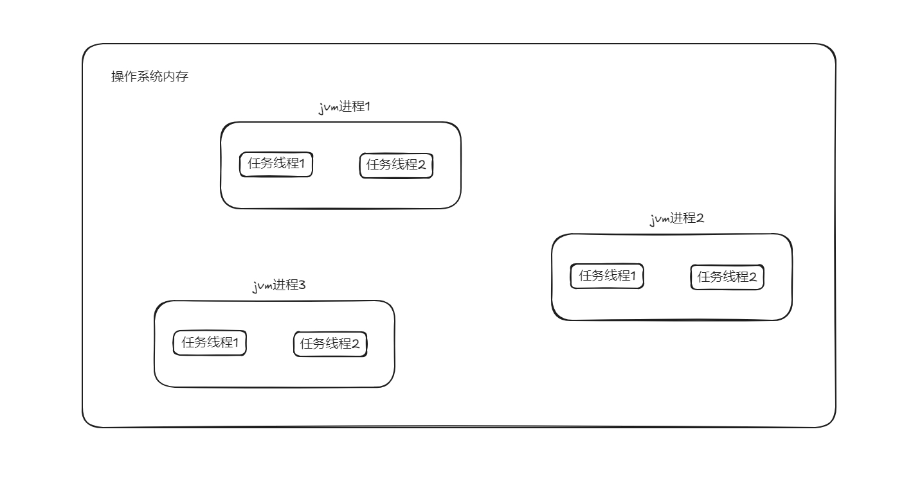
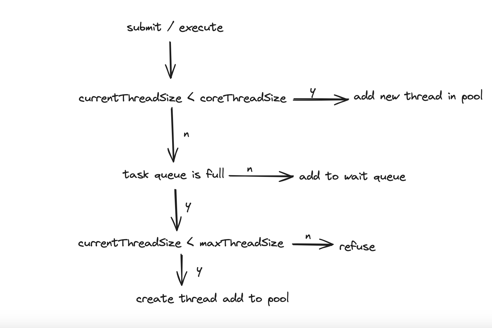

# java个人学习心得笔记.

## java线程.

### 什么是线程？ 

> java编写的程序都是在jvm中运行，当使用java命令启动一个java应用程序后就会启动一个jvm进程。
> 在同一个jvm进程中，有且只有一个进程，就是它自己。在这个jvm环境中，所有程序代码的运行都是以线程来运行。
> 多线程可以理解为***多任务***，一个进程中的多个线程是共享内存块的，当有新的线程产生的时候，
> 操作系统不分配新的内存，而是让新线程共享原有的进程块的内存。
> 因此，***线程间的通信很容易，速度也很快***。 不同的进程因为处于不同的内存块，因此进程之间的通信相对困难。
> 进程是指一个内存中运行的应用程序， 每个进程都有自己独立的一块内存空间，一个进程中可以启动多个线程。
> 在Windows系统中，一个运行的exe就是一个进程。 线程是指进程中的一个执行流程，一个进程可以运行多个线程。
> 比如java.exe进程可以运行很多线程。 线程总是输入某个进程，进程中的多个线程共享进程的内存。



### java中创建线程的方法.

1. 继承Thread类创建线程类
```java
public class TestMain extends Thread{

    public void run() {
        System.out.println(getName());
    }

    public static void main(String[] args) {
        for (int i = 0; i < 2; i++) {
            new TestMain().start();
        }
    }
}
```
::: tip
Java不支持多继承，继承了thread类限制了拓展，不符合面向接口编程原则。
:::

2. 通过Runnable接口创建线程类
```java 
public class TestMain implements Runnable{

    @Override
    public void run() {
        System.out.println(Thread.currentThread().getName());
    }

    public static void main(String[] args) {
        for (int i = 0; i < 2; i++) {
            TestMain testMain = new TestMain();
            new Thread(testMain).start();
        }
    }
}
```
::: tip
适合在需要实现某种任务逻辑而不想与线程的具体实现耦合时使用。
:::

3. 通过Callable和Future创建线程
```java
public class TestMain implements Callable<String> {

    @Override
    public String call() throws Exception {
        System.out.println(Thread.currentThread().getName());
        return "";
    }

    public static void main(String[] args) {
        for (int i = 0; i < 2; i++) {
            TestMain testMain = new TestMain();
            FutureTask<String> futureTask = new FutureTask<>(testMain);
            new Thread(futureTask).start();
        }
    }
}
```
::: tip
适合需要返回结果或处理异常的复杂任务，特别是在并发计算中使用。
:::

4. 使用线程池创建
```java
public class TestMain implements Callable<String> {

    @Override
    public String call() throws Exception {
        System.out.println(Thread.currentThread().getName());
        return "";
    }

    public static void main(String[] args) {
        ExecutorService executorService = Executors.newFixedThreadPool(2);
        for (int i = 0; i < 2; i++) {
            executorService.submit(new TestMain());
        }
    }
}
```
::: tip
适合在需要处理大量并发任务时使用线程池，如服务器端任务、批处理等。
:::

## java线程池.

### 什么是线程池？

> 线程池是一种基于池化思想，用于管理和复用线程资源的机制，它的作用是执行大量的并发任务，同时优化系统的性能和资源利用。
> 在没有线程池的情况下如果需要执行一个任务，每次都会创建一个新线程，当任务完成后线程被销毁。
> 这种频繁的创建和销毁线程的操作会消耗大量的资源，尤其在高并发的情况下，系统性能会受到影响，
> 线程池通过复用已经创建的线程来执行多个任务，避免了频繁的线程创建和销毁，节省了资源。

### 任务提交到线程池的步骤


1. 任务提交： 
    - 调用 execute(Runnable) 或 submit(Callable) 方法将任务提交到线程池。
2. 检查核心线程池：
    - 如果当前线程数小于 corePoolSize，线程池会创建一个新的线程来执行任务。
    - 如果线程数已经达到 corePoolSize，任务将被放入任务队列中等待执行。 
3. 任务队列处理：
    - 如果任务队列未满，任务会被添加到队列中，等待空闲的线程来执行。
    - 如果任务队列已满，且线程池中的线程数量小于 maximumPoolSize，线程池会创建一个新的线程来执行任务。
4. 拒绝策略：
    - 如果线程池中的线程数量达到 maximumPoolSize，且任务队列也已满，新提交的任务将根据配置的拒绝策略来处理。
5. 任务执行：
    - 线程池中的线程从队列中获取任务并执行。任务执行完毕后，线程会继续从队列中获取下一个任务。
    - 如果一个线程在 keepAliveTime 内没有新的任务可执行，且当前线程数量超过 corePoolSize，该线程会被销毁以释放资源。
6. 线程池关闭：
    - 调用 shutdown() 方法后，线程池不再接受新任务，但会继续执行队列中的任务。
    - 调用 shutdownNow() 方法后，线程池尝试停止所有正在执行的任务，并返回未执行的任务列表。

### 线程池的核心参数

1. 核心线程数（corePoolSize）
2. 最大线程数（maximumPoolSize）
3. 任务队列（workQueue）
4. 线程存活时间（keepAliveTime）
5. 时间单位（unit）
6. 线程工厂（threadFactory）
7. 拒绝策略（handler）

:::danger
实际开发中应该尽量避免或禁止使用Executors去创建线程。
:::

### 线程池的最佳实践
